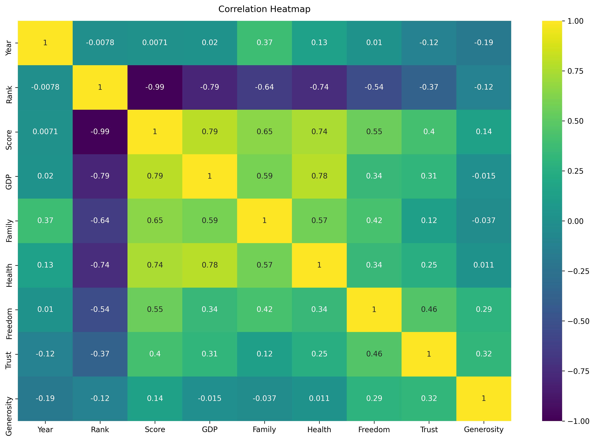

# World Happiness Report
The World Happiness Report is a landmark survey of the state of global happiness. The first report was published in 2012, the second in 2013, the third in 2015, and the fourth in the 2016 Update. The World Happiness 2017, which ranks 155 countries by their happiness levels, was released at the United Nations at an event celebrating International Day of Happiness on March 20th. The report continues to gain global recognition as governments, organizations and civil society increasingly use happiness indicators to inform their policy-making decisions. Leading experts across fields – economics, psychology, survey analysis, national statistics, health, public policy and more – describe how measurements of well-being can be used effectively to assess the progress of nations. The reports review the state of happiness in the world today and show how the new science of happiness explains personal and national variations in happiness.
- GDP per Capita
- Family
- Life Expectancy (Health)
- Freedom
- Generosity
- Trust Government Corruption

Please visit [here](https://www.kaggle.com/unsdsn/world-happiness) for geting more information about this competition and downloading data from **Kaggle**.

In this repository, I was looking for 2 things.

- The ranking of World Happiness
- Where is ranking of Vietnam

The following image is heatmap that representative for the correlation between elements and happiness score.
